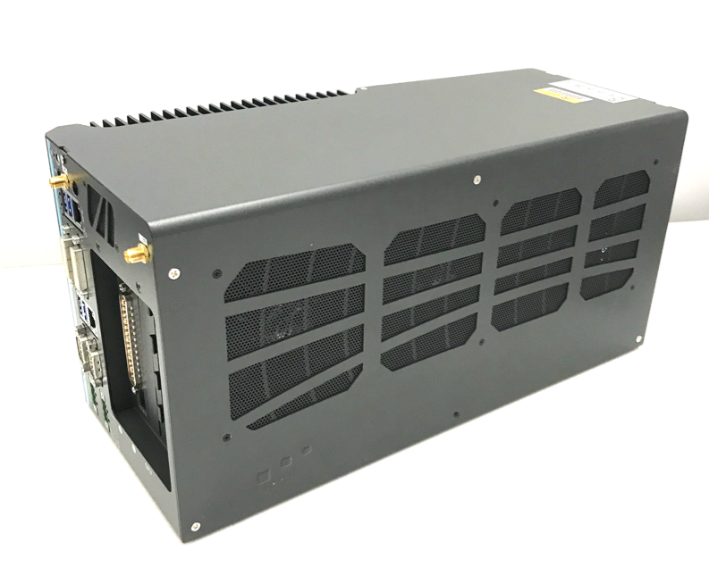
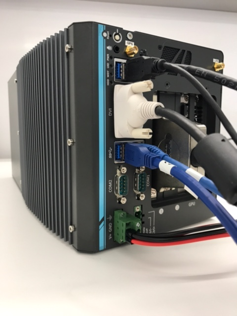

# Nuvo-6108GC配置和安装指南

```
Nuvo-6018GC is world's first industrial-grade GPU computer supporting high-end graphics cards. It's designed to fuel emerging GPU-accelerated applications, such as artificial intelligence, VR, autonomous driving and CUDA computing, by accommodating nVidia GPU with up to 250W TDP. Leveraging Intel® C236 chipset, Nuvo-6018GC supports Xeon® E3 V5 or 6th-Gen Core™ i7/i5 CPU with up to 32 GB ECC/ non-ECC DDR4 memory. It incorporates general computer I/Os such as Gigabit Ethernet, USB 3.0 and serial ports. In addition to the x16 PCIe port for GPU installation, Nuvo-6108GC further provides two x8 PCIe slots so you can have additional devices for information collection and communication.Nuvo-6108GC comes with sophisticated power design to handle heavy power consumption and power transient of a 250W GPU. Furthermore, to have reliable GPU performance for industrial environments, Nuvo-6018GC inherits Neousys' patented design, a tuned cold air intake to effectively dissipate the heat generated by GPU. This unique design guarantees operation at 60°C with 100% GPU loading and makes Nuvo-6018GC extremely reliable for demanding field usage.

----NEOUSYS MARKETING TEAM
```

## IPC配置

参考下述IPC配置：

- 华硕 GTX1080 GPU-A8G-Gaming 显卡

- 32GB DDR4 内存

- PO-280W-OW 280W AC/DC 电源适配器

- 2.5" SATA磁盘 1TB 7200转/秒

  
  
## 准备IPC

参考下述步骤：

1. 准备好CAN卡并进行安装：在Neousys Nuvo-6108GC中，华硕GTX1080 GPU-A8G-Gaming显卡被预先安装在一个PCI插槽中，我们需要将CAN卡安装在另外一个PCI插槽中。

   a. 找到并拧下机器边上的8个螺丝（显示在棕色方框内或棕色箭头指向的区域）

   

   b. 移除机器盖板

   

   在机箱底部将能看到固定着的3个PCI插槽（其中一个已经被显卡占据）

   

   c. 【可选】设置CAN卡的终端跳线：将红色的跳线帽从原位置移除（下图所示）并放置在终端位置

   

   **WARNING**：如果终端跳线没有被正确设置，CAN卡将不能正确工作。

   d. 【可选】将CAN卡插入到一个PCI插槽中

   

   e. 安装IPC的盖板
    
   

2. 配置IPC加电组件：

   a. 将电源线接入到为IPC配置的电源连接器（接线板）
   **WARNING**：确保电源线的正极（标记为 **R** 表示红色）和负极（标记为 **B** 表示黑色）接入到了IPC接线板的正确接口，如下图所示：

   
   
   b. 将显示器、以太网线、键盘和鼠标接入IPC
   
   
  
3. 启动计算机

如果系统接入了一个或多个外部插入卡，建议通过BIOS设置风扇的转速

```
- 计算机启动时按F2进入BIOS设置菜单
- 进入 [Advanced] => [Smart Fan Setting]
- 设置 [Fan Max. Trip Temp] 为 50
- 设置 [Fan Start Trip Temp] 为 20
```

建议使用者使用数字视频接口（DVI）连接器连接显卡和显示器。设置投影到主板的DVI接口，参考下述的设置步骤：

```
- 计算机启动时按F2进入BIOS设置菜单
- 进入 [Advanced]=>[System Agent (SA) Configuration]=>[Graphics Configuration]=>[Primary Display]=> 设置为 "PEG"
```

建议设置IPC的运行状态为一直以最佳性能状态运行：

```
- 计算机启动时按F2进入BIOS设置菜单
- 进入 [Power] => [SKU POWER CONFIG] => 设置为 "MAX. TDP"
```

4.  连接电源：



## 参考资料

1. Neousys Nuvo-6108GC [产品页面](http://www.neousys-tech.com/en/product/application/rugged-embedded/nuvo-6108gc-gpu-computing)

## 免责声明

This device is `Apollo Platform Supported`
